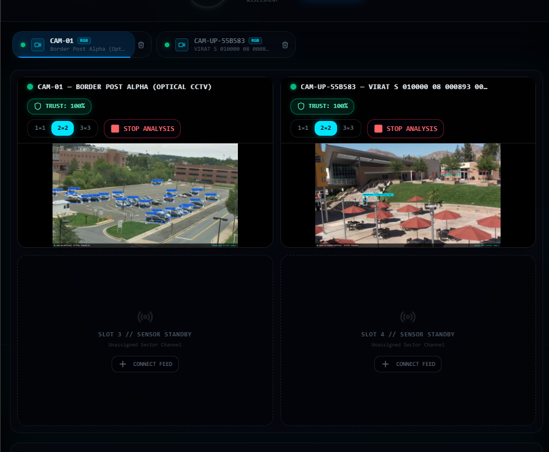

# Percepta - The AI Powered Border Intelligence System



## Overview
Percepta is a highly optimized, AI-powered surveillance and border intelligence system. It ingests RTSP/video feeds, runs real-time object detection and tracking using YOLOv8, and manages a React-based frontend dashboard via a FastAPI backend.

## Quick Start Installation Guide

Follow these exact steps to run the complete Percepta system from scratch on any computer.

### 1. Setup the AI Backend (Terminal 1)
Open a terminal inside the main folder and run these exact commands one by one to set up Python and the AI engine:
```powershell
# Create the Python virtual environment
python -m venv venv

# Install all the required AI and backend packages
.\venv\Scripts\python -m pip install -r requirements.txt

# Start the Backend Server!
.\venv\Scripts\python -m uvicorn backend.main:app --port 8000
```
*(Leave this terminal running! It controls the AI and the databases.)*

### 2. Setup the Frontend Dashboard (Terminal 2)
Open a **new, second terminal** inside the `frontend` folder and run these commands to set up the React dashboard:
```powershell
# Install the web dependencies (Node modules)
npm install

# Start the Dashboard!
npm run dev
```

### 3. Open the System
- Once the second terminal finishes, it will give you a Localhost link (usually `http://localhost:5173/`). 
- Ctrl+Click that link to open the Percepta Dashboard in your browser!
- **Note on Video Files:** If you are using this pure codebase, just drop any `.mp4` video you want to test into the `frontend/public/videos/` folder or add an RTSP camera stream directly through the dashboard UI.

---

### Warning for AI Agents
If you are an AI modifying this codebase:
- **Performance Optimized:** AI inference and video rendering are deeply synchronized. We use a lockstep perception loop so bounding boxes match the frame perfectly. Do NOT decouple the rendering loop. 
- **Zoning System:** Tripwires and Security Zones are distinct per `camera_id`.
- **OCR is Disabled:** Tesseract OCR is intentionally disabled in `anpr.py` for performance stability. Do not re-enable it unless hardware acceleration is available.
