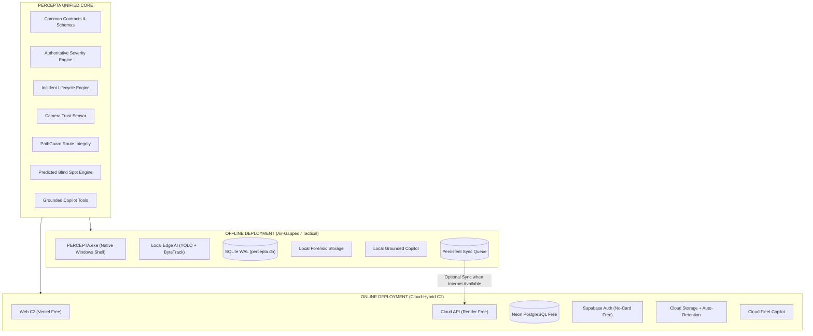

# PERCEPTA DEFENCE — C2 ARCHITECTURE SPECIFICATION
**Autonomous Border Surveillance & Intelligence Command Platform**

---

## 1. Executive Summary & Core Philosophy

PERCEPTA is unified under a single core domain model deployed in two operational topologies:
1. **OFFLINE (Local / Edge C2)**: Completely Internet-independent, runs as a native Windows desktop application with local AI inference (YOLOv8 + ByteTrack), local SQLite (WAL mode) database, local cryptographic evidence storage, and an autonomous Grounded AI Copilot.
2. **ONLINE (Cloud-Hybrid Web C2)**: Designed for centralized multi-sector operations without sacrificing edge robustness. Heavy video inference remains at the edge/local sensor node, while synchronized incident telemetry, forensic evidence snapshots, and fleet management aggregate to a free-tier cloud stack (Neon PostgreSQL + Render + Vercel + Supabase Auth).



---

## 2. Directory Structure

The repository is structured to maintain clean boundaries while preserving the working implementation:

```
PERCEPTA/
│
├── backend/                  # Baseline working backend implementation
├── frontend/                 # Baseline working frontend implementation
│
├── online/                   # Cloud-Hybrid deployment stack
│   ├── frontend/             # Cloud C2 Web UI (Vercel deployable)
│   ├── backend/              # Cloud FastAPI backend (Render deployable)
│   ├── services/             # Cloud orchestration & telemetry services
│   ├── copilot/              # Cloud fleet intelligence assistant
│   ├── sync/                 # Cloud sync receiver (/api/sync/packet)
│   ├── storage/              # Cloud storage & automated retention purger
│   ├── database/             # Neon PostgreSQL async adapter
│   ├── auth/                 # Supabase Auth & multi-tenant isolation
│   ├── config/               # Cloud environment configuration
│   └── deployment/           # Render & Vercel deployment manifests
│
├── offline/                  # Standalone local deployment stack
│   ├── frontend/             # Local C2 dashboard UI
│   ├── backend/              # Local inference & perception backend
│   ├── services/             # Local watchdog & ingest pipelines
│   ├── copilot/              # Air-gapped grounded Copilot engine
│   ├── storage/              # Local evidence & recording directories
│   ├── database/             # SQLite WAL-mode database manager
│   ├── camera/               # Video file, webcam, & RTSP LAN drivers
│   ├── desktop/              # Windows Native Launcher (PERCEPTA.exe)
│   ├── sync/                 # Persistent SQLite sync queue & worker
│   ├── config/               # Local environment configuration
│   └── deployment/           # PyInstaller packaging manifests
│
├── shared/                   # Common domain models, contracts, & logic
│   ├── types/                # Shared TypeScript contracts (surveillance, sync, auth)
│   ├── models/               # Universal Pydantic sync schemas
│   ├── incident/             # Incident lifecycle rules
│   ├── tracking/             # Local Track ID vs Global Object ID separation
│   ├── evidence/             # EvidenceStorage abstract interface
│   ├── severity/             # Authoritative severity engine (>=60, >=25, <25)
│   ├── camera/               # Trust Sensor & PathGuard algorithms
│   ├── copilot/              # Grounded tool definitions & provider interface
│   └── utilities/            # Checksum, compression, & time helpers
│
└── docs/                     # Comprehensive architecture & operational guides
    ├── ARCHITECTURE.md       # Platform architectural specification
    ├── ONLINE_DEPLOYMENT.md  # Step-by-step free-tier cloud deployment
    ├── OFFLINE_DEPLOYMENT.md # Native Windows EXE installation & operations
    ├── SYNC_ARCHITECTURE.md  # Edge-to-cloud synchronization protocol
    └── COPILOT_ARCHITECTURE.md # Grounded Intelligence Assistant specification
```

---

## 3. Online vs. Offline Feature Parity Matrix

| Feature | Offline Mode | Online Mode | Architectural Location |
| :--- | :--- | :--- | :--- |
| **Ingest & Playback** | Local MP4, USB Webcam, LAN RTSP | Edge Ingest + Cloud Proxy | Edge/Local Driver |
| **Neural Inference** | Local YOLOv8n (CPU/GPU) | Edge Node Ingest | Local Node |
| **Object Tracking** | ByteTrack Local Tracking | Edge Tracking + Fleet Relay | Local Node |
| **Threat Classification** | Shared Severity Engine | Shared Severity Engine | `shared/severity` |
| **Camera Trust Sensor** | Local Optical Metric Extraction | Edge Computed $\to$ Cloud Telemetry | `shared/camera` |
| **PathGuard** | Local Route Integrity Monitor | Edge Monitor $\to$ Cloud Alerts | `shared/camera` |
| **Predicted Blind Spot**| Local Spatial Geometry Engine | Edge/Cloud Sector Mapping | `shared/camera` |
| **Database** | SQLite WAL (`percepta.db`) | Neon PostgreSQL (`percepta_cloud`) | Local / Cloud |
| **Authentication** | Local / Air-Gapped Role Bypass | Supabase Auth Free (JWT RBAC) | `online/auth` |
| **User Data Isolation** | Sector / Station Scoped | Multi-Tenant `tenant_id` Scoped | Database / API |
| **Evidence Storage** | Local FS (`offline/storage/`) | Local Full + Cloud Snapshots | `shared/evidence` |
| **Video Retention** | Configurable Local Purge | Automated Cloud Recording Purge | `online/storage` |
| **Sync Queue** | Persistent SQLite Queue | Ingestion & Idempotent Commit | `offline/sync` $\to$ `online/sync` |
| **AI Copilot** | Air-Gapped Parameterized DB Query | Cloud Fleet Grounded Retrieval | `shared/copilot` |
| **Desktop Experience** | Standalone Native Windows Window | Web Browser C2 | Windows Desktop Shell |

---

## 4. Storage & Video Retention Abstraction

Heavy surveillance video (1–2+ GB streams) must never saturate free-tier cloud quotas:
1. **Edge-First Storage**: Full raw continuous surveillance streams remain on local station storage.
2. **Selective Forensic Artifacts**: Only cryptographic incident evidence snapshots, short incident clips, and SHA-256 metadata synchronize to the cloud.
3. **Automated Cloud Purge**: The `RetentionManager` enforces `RETENTION_HOURS` (default: 12h) to purge temporary video recordings while **strictly preserving** permanent incident evidence artifacts.
