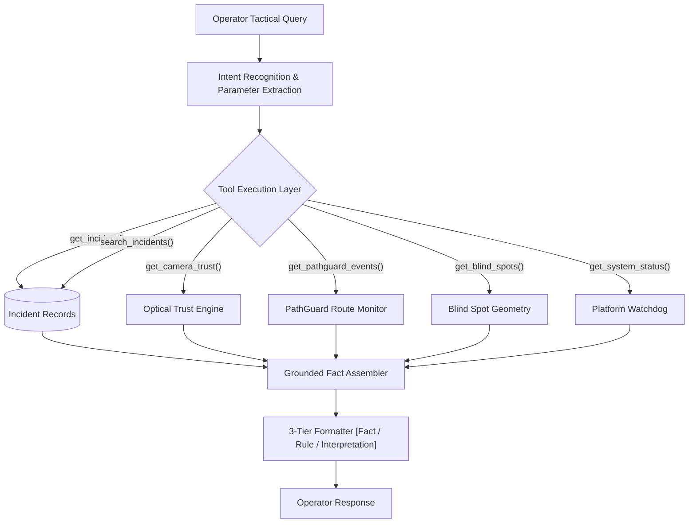

# PERCEPTA DEFENCE COPILOT ARCHITECTURE
**Grounded Tactical Intelligence Assistant with Anti-Hallucination Guardrails**

---

## 1. Grounding Philosophy & 3-Tier Output Structure

The PERCEPTA Defence AI Copilot is an evidence-grounded intelligence assistant designed for defense and border surveillance operators. Unlike generic LLM chat wrappers, it enforces a strict 3-tier epistemological separation:

1. **`[OBSERVED FACT]`**: Pure, verifiable empirical data retrieved directly from the database (timestamps, track IDs, spatial coordinates, camera IDs, optical metrics).
2. **`[DETERMINISTIC RULE RESULT]`**: Direct outputs of mathematical algorithms and security rules (Polygon containment, Vector crossing, Threshold comparisons).
3. **`[AI INTERPRETATION / SUMMARY]`**: Contextual synthesis and operational insights clearly marked as AI interpretation.

If requested data is absent from the system, the Copilot explicitly responds:
> *"The system does not currently have records matching this query."*
It **never fabricates** track IDs, threat levels, or forensic timestamps.

---

## 2. Tool-Based Architecture

The Copilot interacts with the system exclusively through parameter-validated retrieval tools:



### Registered Grounded Tools
| Tool Name | Scope | Description |
| :--- | :--- | :--- |
| `get_incident(incident_id)` | Incident | Retrieve comprehensive lifecycle state, severity, and evidence hashes |
| `search_incidents(severity, camera_id, limit)` | Fleet | Filter active or historical incidents by severity and sector |
| `get_camera_trust(camera_id)` | Sensor Health | Retrieve optical clarity, blur, brightness, and signal stability factors |
| `get_pathguard_events(camera_id)` | Route Integrity | Query unauthorized route deviation and boundary crossing alerts |
| `get_blind_spots(camera_id)` | Geometry | Retrieve predicted perimeter coverage gaps and unmonitored blind spots |
| `get_system_status()` | Watchdog | Query active inference FPS, drop rates, and connected sensor health |

---

## 3. Offline vs. Online Execution

### Offline Execution Mode (Air-Gapped)
- **Engine**: `LocalCopilotProvider`
- **Data Source**: Local SQLite database (`percepta.db`) via `ControlledQueryLayer`.
- **Inference**: Fully deterministic local synthesis. Requires zero cloud API keys, zero internet access, and runs on air-gapped field laptops.

### Online Execution Mode (Cloud-Hybrid)
- **Engine**: `CloudCopilotProvider`
- **Data Source**: Multi-tenant Neon PostgreSQL cloud database.
- **Inference**: Combines parameter-validated tool queries with cloud LLM summarization. Tenant isolation ensures the assistant only accesses data belonging to the authenticated officer's unit.

---

## 4. Example Grounded Interactions

### Example 1: Critical Incident Query
**Operator**: *"Show me today's critical incidents."*
```text
[OBSERVED FACT]
- Incident INC-20260927-001 at 12:45:10 UTC on Camera CAM-01 (Perimeter North).
- Object Track ID: #14 (Person).
- Attached Evidence: 1 snapshot (SHA-256: 4a9f81bc...), 1 video clip.

[DETERMINISTIC RULE RESULT]
- Threat Score: 78.5 >= 60.0 (Authoritative Classification: CRITICAL).
- Trigger: RESTRICTED_ZONE_VIOLATION in Zone 'Ammunition Depot'.

[AI INTERPRETATION / SUMMARY]
A single individual breached the designated high-security perimeter zone. Immediate physical verification recommended.
```

### Example 2: Camera Trust Query
**Operator**: *"How is the health of Camera 02?"*
```text
[OBSERVED FACT]
- Camera: CAM-02 (East Ridge IR).
- Trust Score: 94% (HIGH TRUST).
- Signal Stability: 100% (Zero dropped frames in last 500 samples).
- Blur Factor: 0.12 (Optimal sharpness).
- Illumination: Nominal.

[DETERMINISTIC RULE RESULT]
- Status: OPERATIONAL and FULLY TRUSTED for automated perimeter alerting.
```
