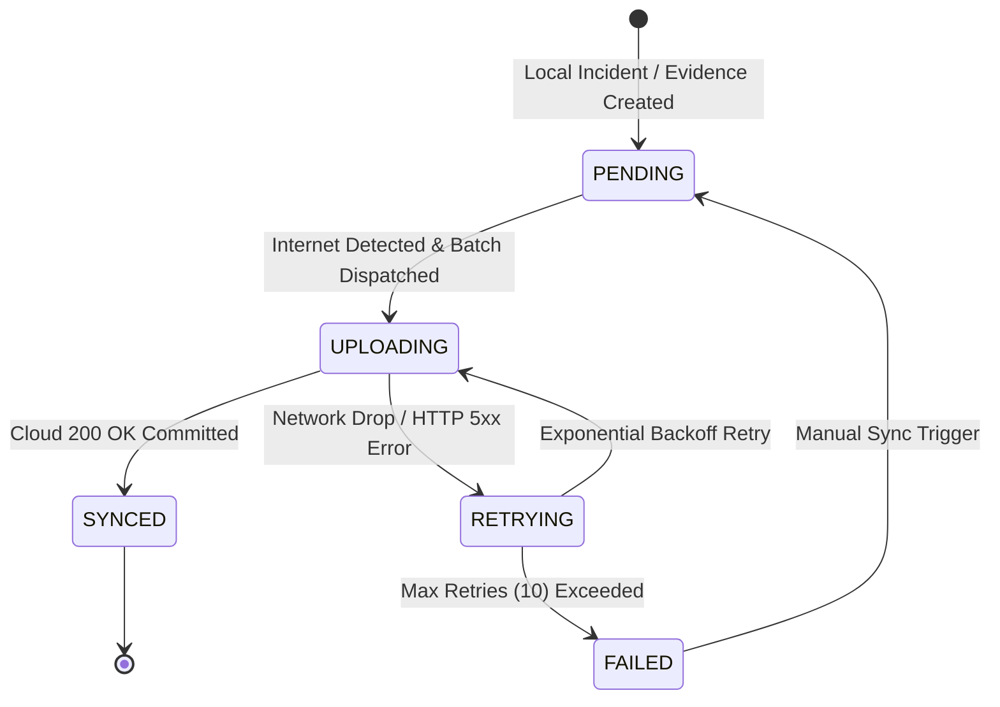

# PERCEPTA SYNCHRONIZATION ARCHITECTURE
**Edge-to-Cloud Resilient Replay & Persistent Queue Protocol**

---

## 1. Synchronization Principles

The synchronization layer enables disconnected edge surveillance nodes to operate autonomously during network blackouts and seamlessly replay incidents, evidence metadata, and operator actions to Cloud C2 when network connectivity is restored.

### Core Guarantees
1. **Zero Data Loss**: Incidents and evidence generated offline persist indefinitely in SQLite until acknowledged by the cloud.
2. **Idempotence**: Duplicate deliveries caused by network timeouts or retries are deduplicated at the cloud receiver using immutable `sync_id` and `incident_id` keys.
3. **Deterministic Conflict Resolution**: Local forensic evidence and original incident timestamps are immutable and authoritative. Cloud updates (such as remote command acknowledgements) are merged without overwriting local forensic records.
4. **Bandwidth Optimization**: Only structured incident packets and SHA-256 evidence metadata are queued by default. Multi-gigabyte raw video streams remain local.

---

## 2. Sync State Machine



### State Definitions
- **`PENDING`**: Event recorded locally; awaiting cloud network availability.
- **`UPLOADING`**: Payload currently in flight across network.
- **`SYNCED`**: Successfully committed to Cloud Neon database; confirmed by cloud response.
- **`RETRYING`**: Transient failure occurred (e.g. connection timeout); scheduled for exponential backoff replay.
- **`FAILED`**: Repeated delivery failure; alerted to station supervisor for inspection.

---

## 3. Persistent Queue Schema

The queue is stored in SQLite (`percepta_sync.db`), ensuring it survives system reboots and power outages:

```sql
CREATE TABLE IF NOT EXISTS sync_queue (
    sync_id TEXT PRIMARY KEY,
    entity_type TEXT NOT NULL,         -- 'INCIDENT', 'EVIDENCE', 'CAMERA', 'ZONE', 'TRIPWIRE'
    entity_id TEXT NOT NULL,           -- Primary entity key (e.g. INC-20260927-001)
    source_device_id TEXT NOT NULL,    -- Edge station UUID
    payload TEXT NOT NULL,             -- JSON encoded entity state
    state TEXT NOT NULL DEFAULT 'PENDING',
    retry_count INTEGER NOT NULL DEFAULT 0,
    last_error TEXT,
    created_at TEXT NOT NULL,
    updated_at TEXT NOT NULL
);
CREATE INDEX IF NOT EXISTS idx_sync_state ON sync_queue (state);
```

---

## 4. Conflict Resolution Strategy

| Conflict Scenario | Resolution Rule | Rationale |
| :--- | :--- | :--- |
| **Local Incident Created vs Cloud Incident Exists** | Deduplicate by `incident_id` | Prevents duplicate alert records if edge resent packet |
| **Edge Acknowledged vs Cloud Acknowledged** | Logical OR (`acknowledged = true`) | If either edge or cloud acknowledged, incident is acknowledged |
| **Evidence Hash Discrepancy** | Local Edge Hash is Authoritative | The edge camera sensor is the physical origin of forensic truth |
| **Zone Configuration Divergence** | Version increment + Timestamp check | Highest monotonic `version` number wins |

---

## 5. Security & Verification

1. **Bearer Authentication**: All sync requests include an encrypted station token (`Authorization: Bearer <station_jwt>`).
2. **Payload Checksum**: Each packet includes SHA-256 integrity hashes for all attached evidence files.
3. **Audit Trail**: Every sync transaction records `synced_at`, `source_device_id`, and `processed_by` metadata.
